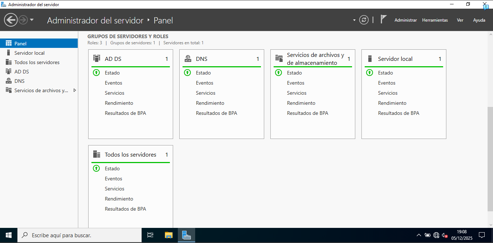
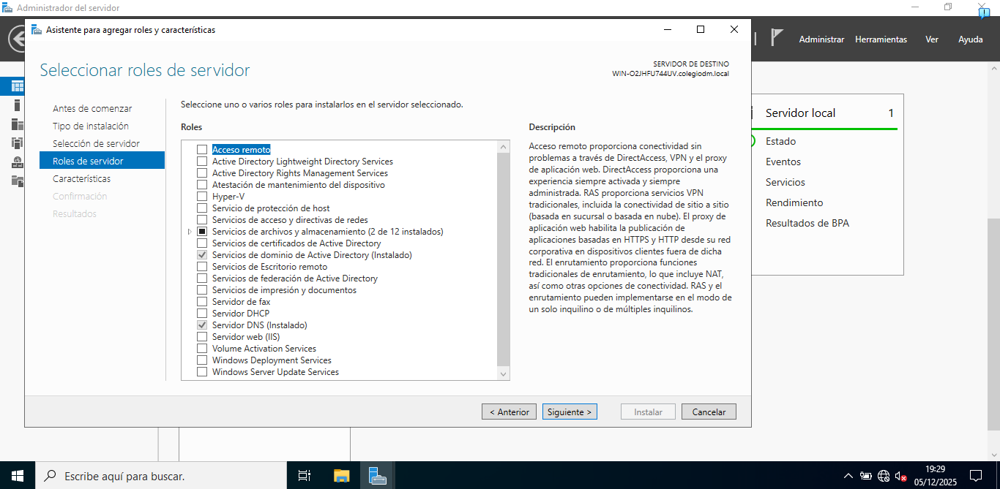
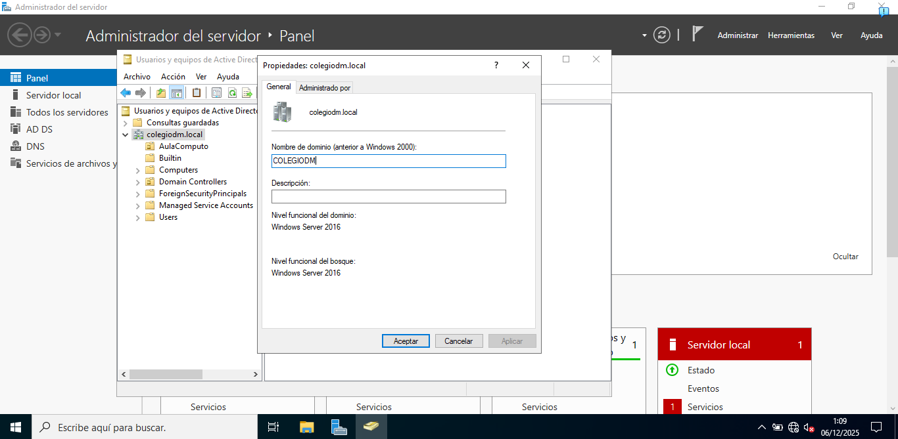
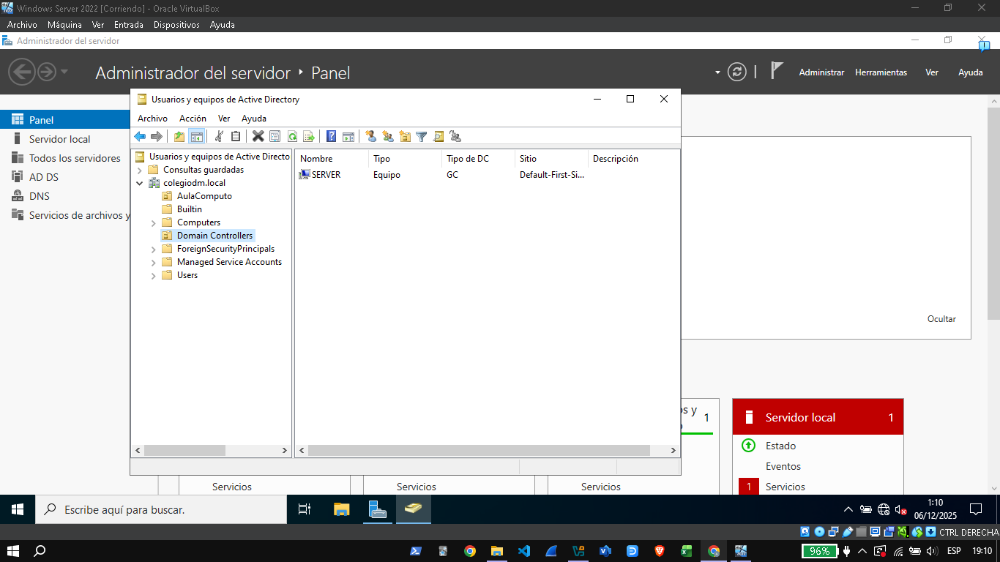
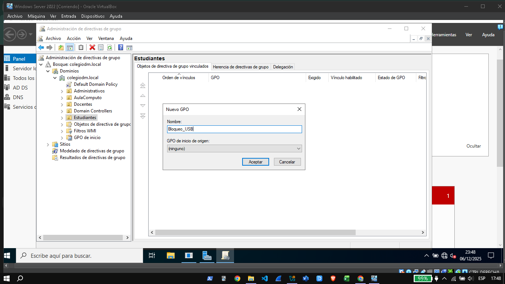
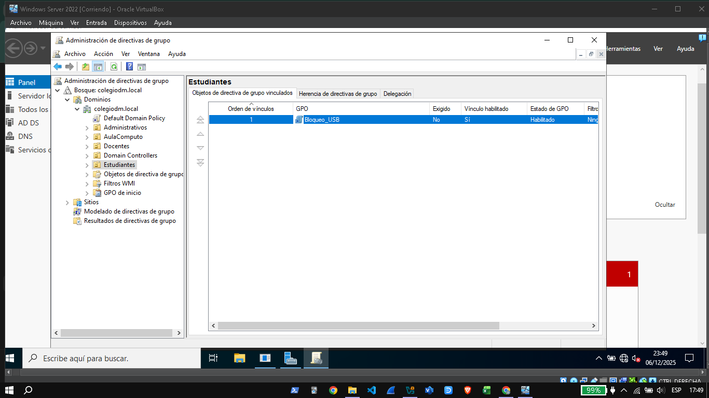
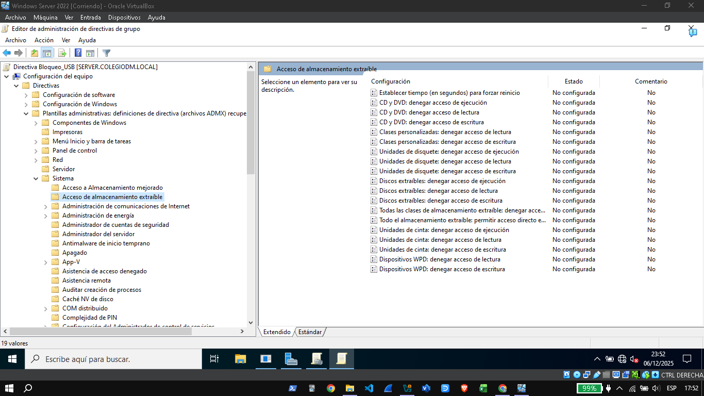
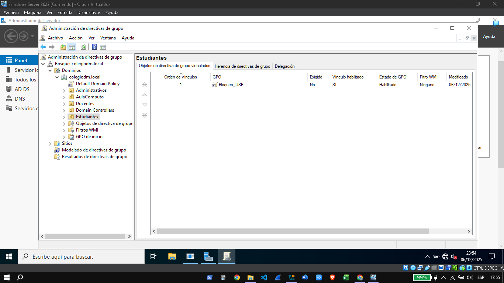

## Implementación de Active Directory, Gestión de Usuarios y Configuración de GPO en Windows Server ##

## 1. Introducción
El presente informe detalla el proceso de instalación, configuración y administración de un dominio en Windows Server 2016, incluyendo:

- Implementación de **Active Directory Domain Services (AD DS)** y **DNS**  
- Verificación del dominio y propiedades  
- Creación de la estructura organizativa (OU)  
- Gestión de usuarios y grupos  
- Configuración y aplicación de **Políticas de Grupo (GPO)**, incluyendo el bloqueo de dispositivos USB  
- Validación de la aplicación de políticas

Toda la documentación incluye capturas de pantalla almacenadas en la carpeta `screenshots/` del repositorio.

---

## 2. Instalación de AD DS y DNS

Se instaló el rol **Active Directory Domain Services (AD DS)** junto con el rol DNS necesario para la resolución interna del dominio.

### Figura 1. Roles instalados

### Figura 2. Asistente de instalación AD DS + DNS

---

## 3. Verificación del Dominio y Controladores

Una vez instalado AD DS, se verificó la configuración del dominio **colegiodm.local**, incluyendo los niveles funcionales del bosque y del dominio.

### Figura 3. Propiedades del dominio

### Figura 4. Controladores del dominio

---

## 4. Creación de Estructura Organizativa (OU)

Se diseñó una estructura ordenada para gestionar usuarios y políticas de manera eficiente.  

La estructura incluye:
- OU **Administrativos**
- OU **Docentes** (con grupos asociados)
- OU **Estudiantes**

### Figura 5. OUs principales creadas

### Figura 6. OU Administrativos

### Figura 7. OU Estudiantes – Usuarios creados

### Figura 8. Usuarios y grupos Docentes

---

## 5. Implementación de GPO: Bloqueo de dispositivos USB

Se creó una política de seguridad aplicada específicamente a la OU **Estudiantes**, destinada a **bloquear completamente el acceso a dispositivos de almacenamiento USB**.

### 5.1 Creación de la GPO
La política fue creada desde la consola de administración de directivas de grupo (GPMC).

### Figura 9. Crear GPO — Bloqueo USB

---

## 5.2 Configuración de la GPO

Se configuraron los siguientes parámetros:

- **Computer Configuration → Administrative Templates → System → Removable Storage Access**
- “**Deny all access**” habilitado
- Aplicación solo para equipos dentro de la OU Estudiantes

### Figura 10. GPO vinculada a Estudiantes

### Figura 11. Edición de la política — Almacenamiento extraíble

### Figura 12. Denegar acceso total

---

## 6. Verificación de la aplicación de la política

Se validó que la política esté correctamente vinculada y que se aplique únicamente a la OU correspondiente.

### Figura 13. Resultado final de la GPO

---

## 7. Conclusiones

- El dominio **colegiodm.local** quedó correctamente implementado y operativo.  
- La estructura de OUs facilita la administración del personal y estudiantes.  
- La GPO de bloqueo USB fue configurada y aplicada exitosamente para reforzar la seguridad.  
- La documentación generada permite auditoría, mantenimiento y futuras mejoras en la infraestructura.

---

## 8. Material de apoyo
Todos los archivos multimedia se encuentran en la carpeta:
/screenshots/

