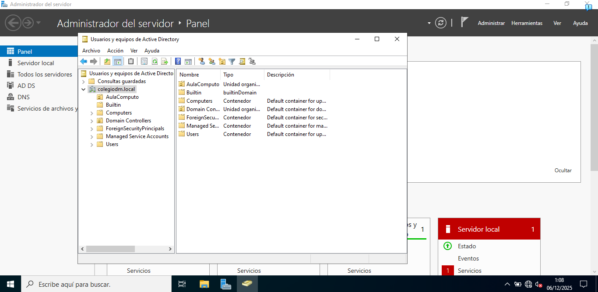
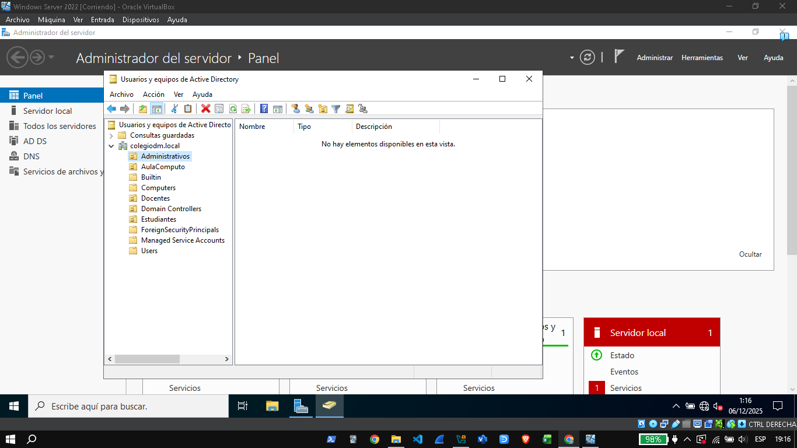
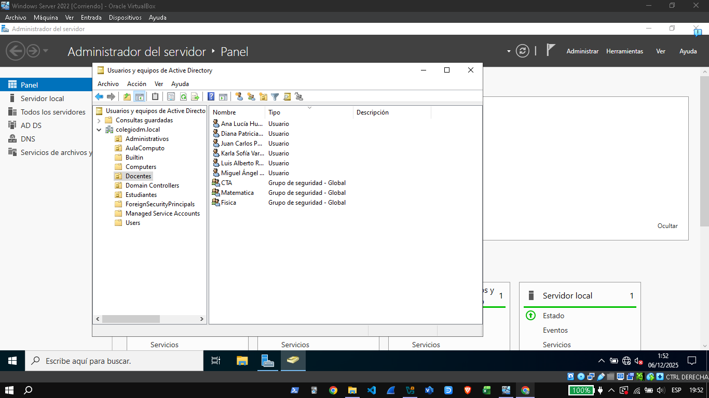

# 👥 Estructura y Diseño de Active Directory

El diseño de las Unidades Organizativas (OU) del dominio fue implementado para facilitar la aplicación de Políticas de Grupo (GPO) y la delegación de administración.

## 1. Jerarquía de Unidades Organizativas

La jerarquía sigue un modelo funcional, separando las identidades por su rol principal dentro de la organización.

* **OUs Creadas:**
    * `OU=Docentes`
    * `OU=Estudiantes`
    * `OU=Administrativos`

## 2. Implementación en ADUC

A continuación, se visualiza la estructura creada en la consola de **Usuarios y Equipos de Active Directory (ADUC)**.

### 2.1. OUs Base

La vista general del dominio (`colegiodm`) muestra las OUs principales.

### 2.2. Usuarios y Grupos

* **Administrativos:** Contiene cuentas con privilegios elevados.
    

* **Estudiantes:** Contiene las cuentas de usuario de los estudiantes. (Aquí se aplica la GPO de Bloqueo USB).
    

* **Docentes:** Contiene cuentas de docentes y sus grupos de seguridad asociados.
    
